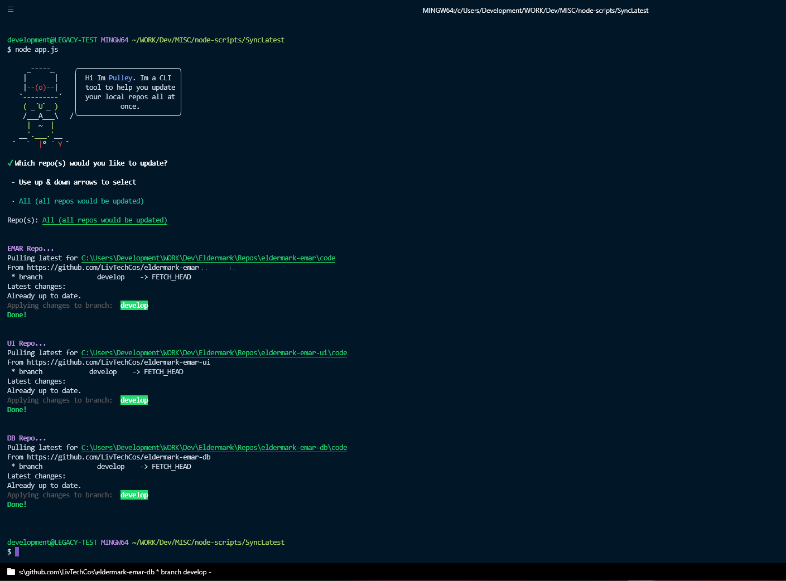
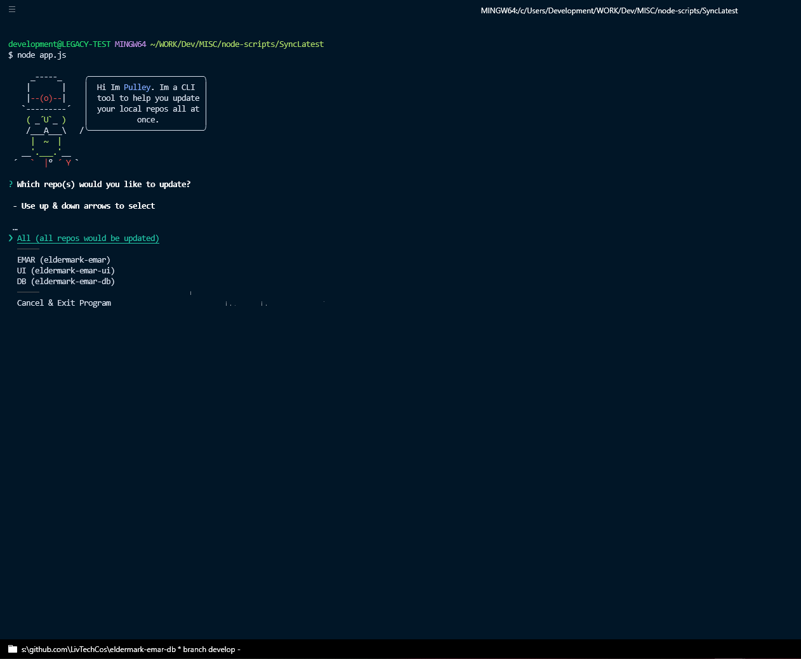

# Pulley CLI

An easy-to-use CLI tool for updating multiple local repos at once.

---





---

## Installation

1. Fork the repo: `git clone https://github.com/EstenGrove/pulley-cli.git`
2. Install deps: `npm install`
3. Update the repo directories within `app.js` file
4. Run it: `node src/app.js`

## Install as Global Package

1. Change into project directory: `cd my-pulley-copy/`
2. Create a "bin" folder: `mkdir bin`
3. Create an index file inside of the "bin/" directory: `touch bin/index.js`
4. Open the package.json file in your code editor
5. Add a bin entry, point main to bin/index.js and add a command alias inside bin:
   1. Update `"main": "bin/index.js"`
   2. Add a "bin" entry: `"bin": { }`
   3. Add a command alias inside the "bin" entry: `"bin": { "pulley": "./bin/index.js" }`

```json
{
	// ...rest of package.json
	"main": "bin/index.js",
	"bin": {
		"pulley": "./bin/index.js"
	}
}
```

6. Now you can run `pulley` command from any directory anywhere on your machine!

---
